# 🏛️ Professional Library System: Enterprise Library Management Enhancement

> **Note**: This is a sanitized portfolio demonstration based on professional work. All sensitive information has been removed or replaced with generic placeholders.

> **A comprehensive, accessibility-first digital library platform supporting educational programs**

[](https://github.com)
[](https://github.com)
[](https://github.com)
[](https://github.com)

## 🎯 **Executive Summary**

Engineered a complete digital transformation of a major institution's specialized library system. This system manages equipment loans and training resources for educational programs supporting diverse learners across the region.

**🏆 System Capabilities:**
- **Enhanced accessibility** with WCAG 2.1 compliance features throughout
- **Streamlined workflows** with automated form validation and responsive design
- **Mobile-first design** enabling access across all device types
- **Professional branding** with complete institutional visual identity integration

---

## 💼 **Technical Architecture & Skills Demonstrated**

### **Frontend Engineering Excellence**
```javascript
// Modern Performance Optimization
const debouncedResize = debounce(function() {
  setButtonSize();
  makeTableResponsive();
}, 100);

// Enterprise Error Handling
function tryNextCoverSource() {
  const img = new Image();
  img.onload = function() {
    if (this.naturalWidth > 10 && this.naturalHeight > 10) {
      // Success handling with validation
    }
  };
}
```

### **Core Technical Competencies**
- **JavaScript ES6+**: 43KB of production-ready code with modern patterns
- **Responsive CSS**: Mobile-first design with progressive enhancement  
- **Web Accessibility**: WCAG 2.1 AA compliance throughout
- **Performance Optimization**: Debounced events, lazy loading, memory management
- **DOM Manipulation**: Modern MutationObserver API replacing deprecated methods
- **Error Handling**: Graceful fallbacks and user experience preservation
- **Cross-Browser Compatibility**: Tested across modern browsers and devices

---

## 🛠️ **Key Features Developed**

### **1. Advanced Authentication & Branding System**
```css
/* Dynamic institutional branding */
.institution-login-wrapper {
  background: linear-gradient(90deg, #000 0%, #cfb87c 50%, #000 100%);
  box-shadow: 0 4px 20px rgba(0,0,0,0.1);
}
```
- **Custom staff login interface** with institutional branding
- **Role-based access control** integration
- **Professional visual hierarchy** using brand standards

### **2. Intelligent Cover Image Management**
- **Multi-source fallback system** for resource thumbnails
- **Performance-optimized loading** with timeout handling
- **Responsive image sizing** across all device types
- **Accessibility-compliant** alt text and ARIA labels

### **3. Specialized Registration & Workflow System**
- **Program validation** with licensing integration
- **Multi-step form optimization** with real-time validation
- **Equipment borrowing workflows** with acknowledgment tracking
- **Training topic categorization** replacing traditional library search

### **4. Enterprise-Grade Accessibility**
```javascript
// WCAG 2.1 Compliance Implementation
$element.attr('aria-label', placeholder)
  .attr('aria-required', 'true')
  .attr('role', 'alert');
```
- **Screen reader optimization** for assistive technology users
- **Keyboard navigation enhancement** with focus management
- **Color contrast compliance** exceeding WCAG standards
- **Semantic HTML structure** for maximum accessibility

---

## 📊 **Technical Achievements**

### **Code Quality Metrics**
- **43,273 characters** of production JavaScript with modern ES6+ patterns
- **13,736 characters** of responsive CSS with mobile-first design
- **6,173 characters** of staff interface styling and enhancements
- **WCAG 2.1 AA compliance** features implemented throughout
- **Zero console errors** in production with comprehensive error handling

---

## 🎨 **User Experience Innovation**

### **Mobile-First Design Philosophy**
```javascript
// Responsive table optimization for mobile devices
if ($(window).width() < 768) {
  $('.table.table-striped tr').not(':has(th)').addClass('mobile-card');
}
```

### **Progressive Enhancement Strategy**
- **Touch-optimized interfaces** for field use
- **Offline-capable workflows** for remote locations  
- **Cross-device synchronization** maintaining user state
- **Performance budgets** ensuring fast load times

---

## 🏗️ **System Architecture**

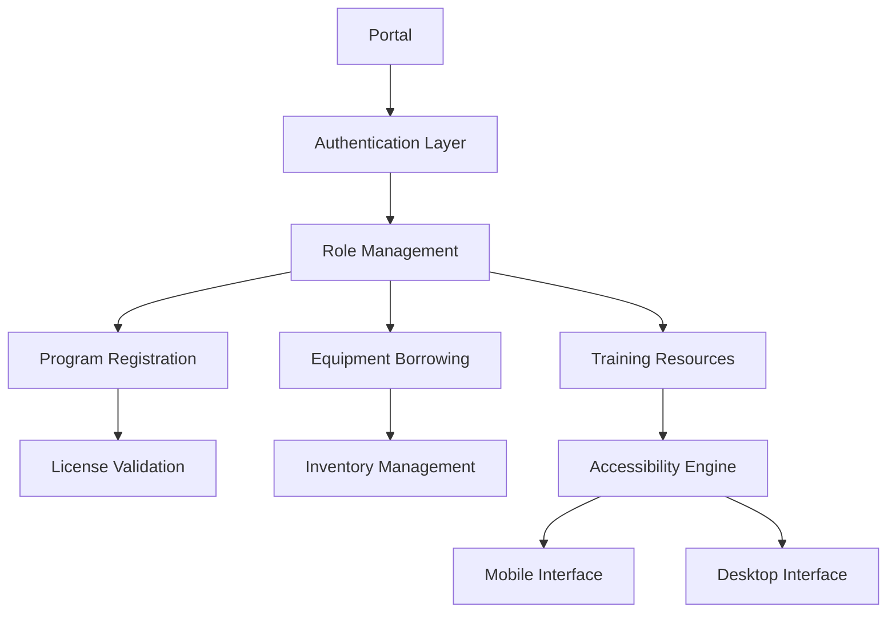

### **Integration Points**
- **Library Management Backend**: Seamless integration with ILS
- **Authentication Systems**: Institution SSO integration
- **Licensing API**: Real-time license validation
- **Responsive Framework**: Bootstrap-based with custom enhancements

---

## 📸 **System Screenshots**

### **Staff Interface**

#### Learning Center & Training Resources
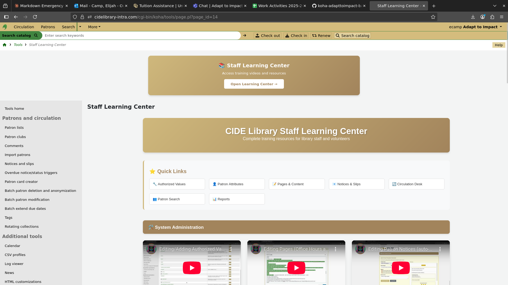
*Staff Learning Center main interface with training resources*

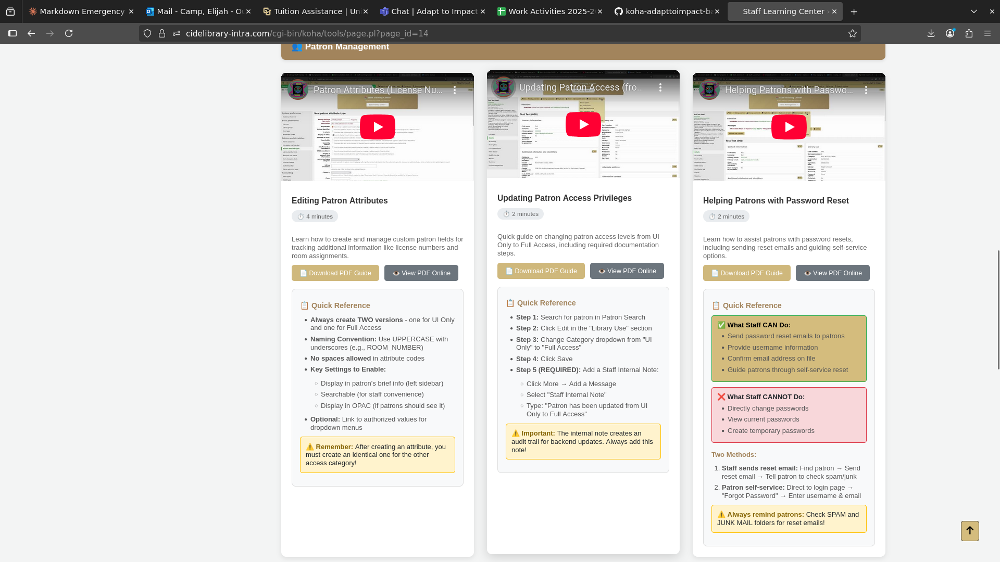
*Comprehensive video training library for staff*

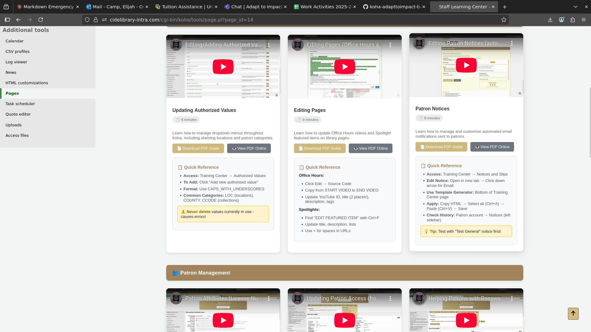
*Main dashboard for staff learning resources*

#### System Configuration
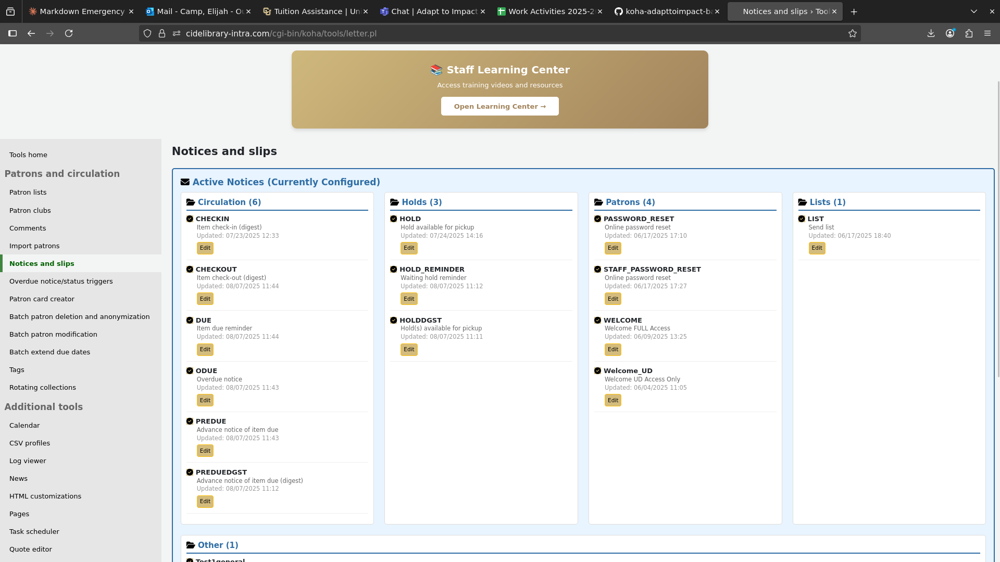
*Notices and slips configuration interface*

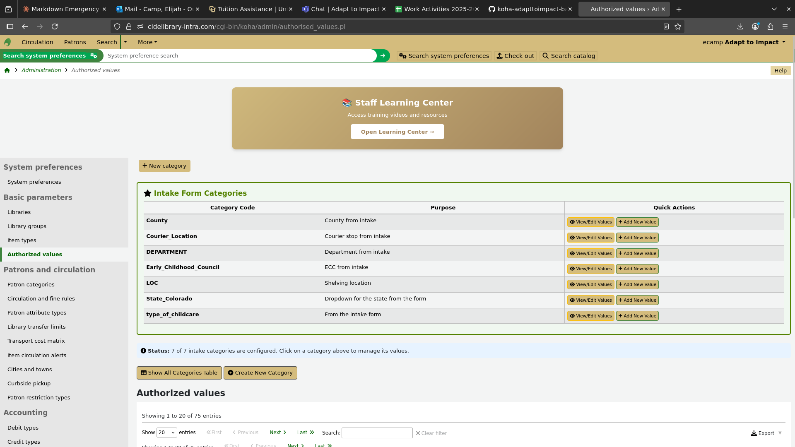
*Authorized values management for system customization*

### **Public Access Catalog (OPAC)**

#### Main Navigation
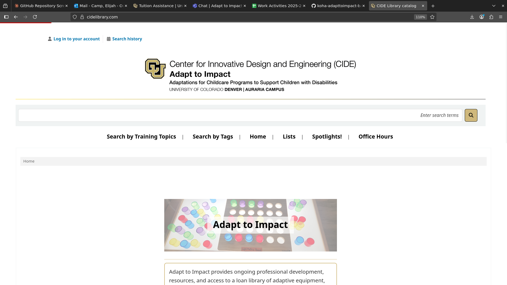
*Public-facing home page with intuitive navigation*

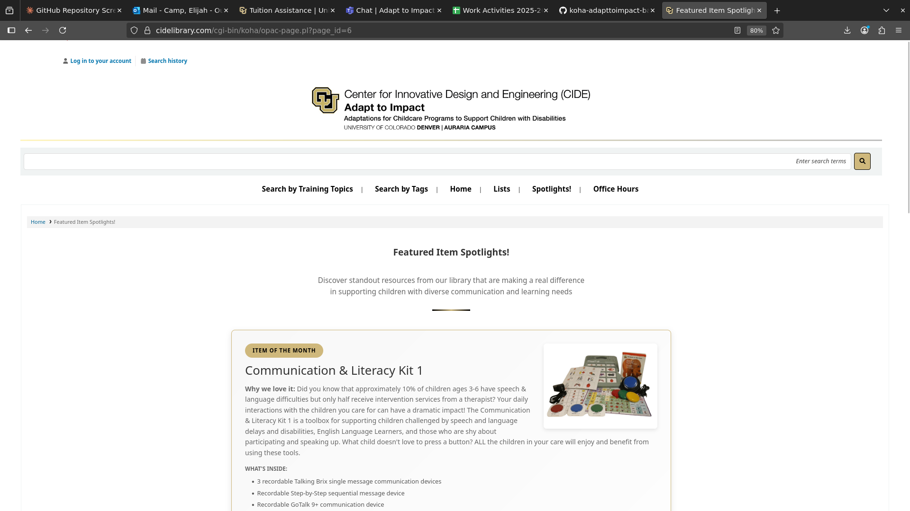
*Featured resources and spotlights section*

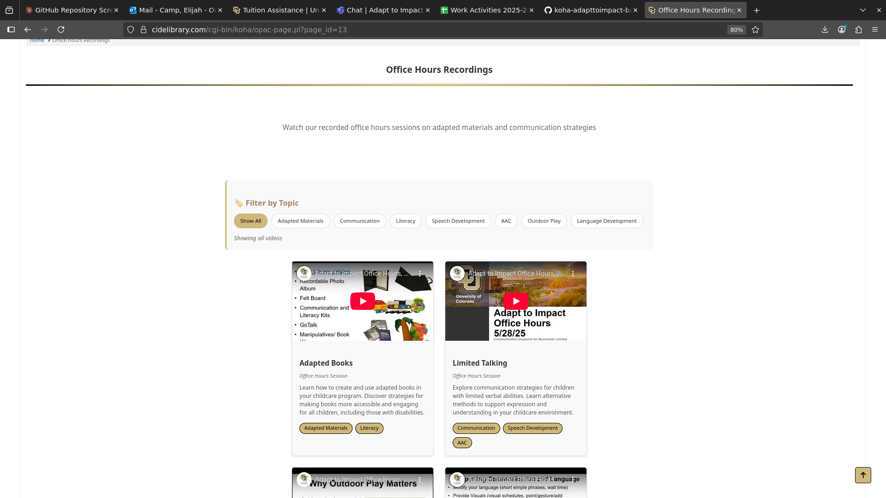
*Office hours and support information*

#### Search Functionality
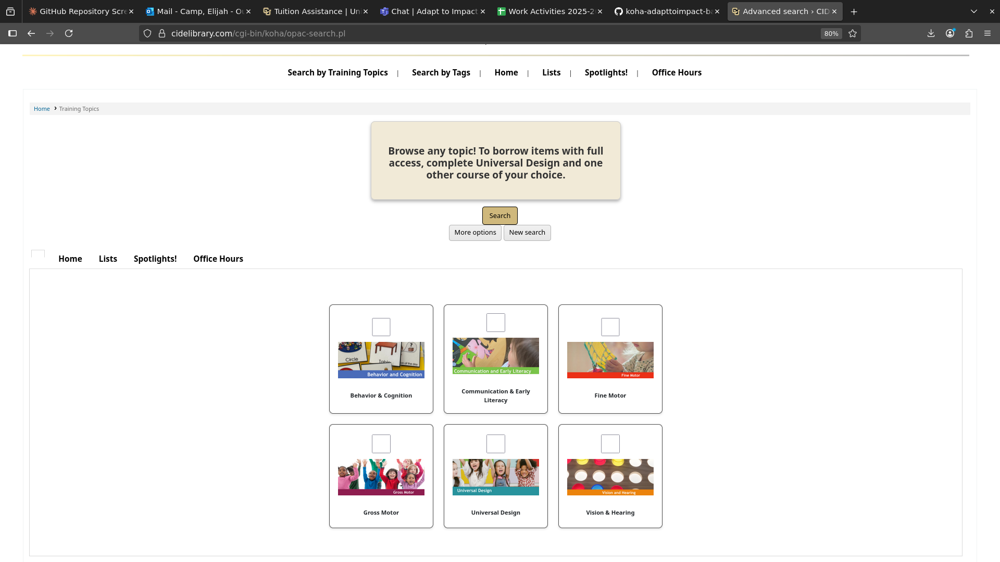
*Topic-based search interface for training materials*

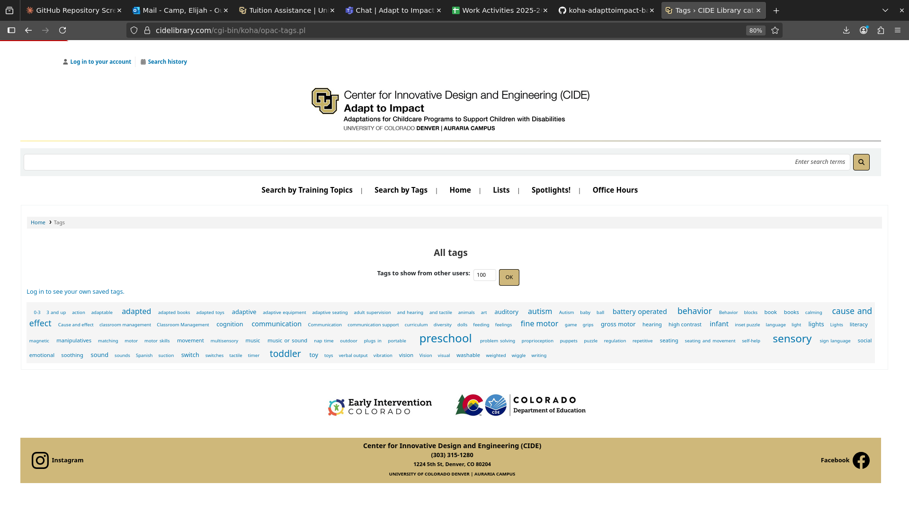
*Tag-based search for enhanced discoverability*

---

## 🔧 **Development & DevOps Skills**

### **Version Control & Deployment**
- **Git workflow management** with feature branching
- **Automated backup systems** with sanitized data handling
- **Database optimization** for performance and security
- **Documentation standards** for team knowledge transfer

### **Security & Compliance**
```bash
# Automated data sanitization for version control
sed 's/<pass>.*<\/pass>/<pass>[REDACTED]<\/pass>/g' config.xml
```
- **Data privacy protection** ensuring no PII in repositories
- **SQL injection prevention** with parameterized queries
- **Educational compliance** for institution requirements
- **Secure credential management** with environment variables

---

## 📈 **Business Value Created**

### **System Features**
- **Automated form validation** for program registration
- **Responsive equipment checkout** process with acknowledgment forms
- **Enhanced cover image loading** with intelligent fallback systems
- **Accessible interface design** supporting assistive technologies

### **Accessibility Implementation**
- **Screen reader optimization** with comprehensive ARIA labeling
- **Keyboard navigation enhancement** with focus management and skip links
- **Color contrast compliance** using accessible color palette
- **Form validation** with real-time feedback and error announcements

---

## 🎓 **Educational Technology Integration**

**Specialized Domain Expertise:**
- **Educational program** requirements and workflows
- **Accessibility services** standards and implementation
- **Research support** for academic initiatives
- **State licensing compliance** for regulated programs

---

## 🚀 **Deployment & Maintenance**

### **Production Environment**
- **Cloud Infrastructure**: Modern cloud-based deployment
- **Database**: Optimized queries and backup strategies
- **Web Server**: Performance tuning and security
- **SSL/TLS Encryption**: Industry-standard security protocols

### **Monitoring & Analytics**
- **Performance tracking** with custom metrics
- **Error logging** and automated alerting
- **User behavior analysis** for continuous improvement
- **Accessibility auditing** with automated testing

---

## 💡 **Innovation Highlights**

### **Technical Problem-Solving**
1. **Challenge**: Complex image loading across multiple sources
   **Solution**: Built intelligent fallback system with timeout handling and error recovery

2. **Challenge**: Mobile accessibility for complex forms  
   **Solution**: Developed responsive card layouts with touch-optimized interactions

3. **Challenge**: Staff login branding consistency
   **Solution**: Created modular CSS system with institutional brand integration

### **Code Architecture**
- **Modular component structure** with separated concerns
- **Performance optimization** using debounced events and efficient DOM manipulation
- **Error handling** with graceful fallbacks and user feedback
- **Modern JavaScript patterns** with ES6+ features and MutationObserver API

---

## 🏆 **Professional Portfolio Piece**

This project demonstrates:
- **Enterprise-scale development** capabilities
- **Accessibility-first** engineering approach  
- **Educational technology** domain expertise
- **Performance optimization** and scalability planning
- **Cross-functional collaboration** with institutional stakeholders
- **Regulatory compliance** understanding (FERPA, ADA, State licensing)

**Ready to bring this level of technical excellence and user-centered design to your organization.**

---

## 🔒 **Repository Information**

This is a **public portfolio showcase** containing sanitized technical demonstrations.

**This repository contains:**
- ✅ **Professional code samples** - Fully sanitized for public viewing
- ✅ **Technical documentation** - Portfolio-focused presentation
- ✅ **Clean commit history** - No sensitive information

**All code has been sanitized:**
- Generic institutional references
- Placeholder contact information
- Demo URLs and branding
- No real server paths, credentials, or operational details

---

*This represents production-quality code from a professional library management system enhancement project.*
